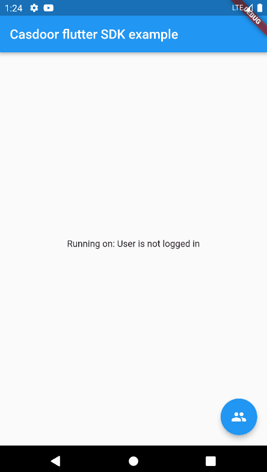
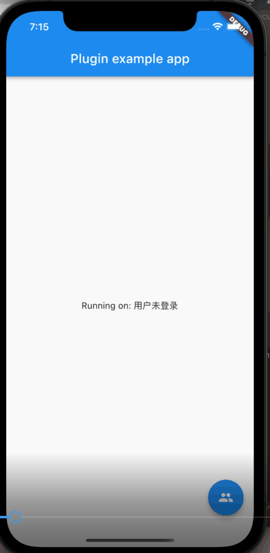
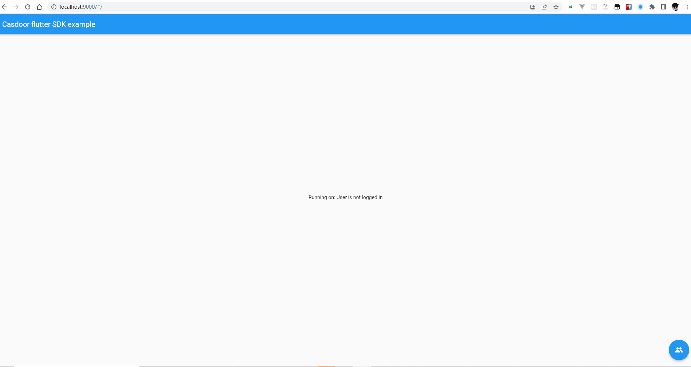

# Casdoor Flutter SDK

<p align="center">
    <a href="https://pub.dev/packages/casdoor_flutter_sdk"></a>
    <a href="https://pub.dev/packages/casdoor_flutter_sdk" alt="Pub.dev popularity"></a>
    <a href="https://pub.dev/packages/casdoor_flutter_sdk"></a><br/>
    <a href="https://pub.dev/packages/casdoor_flutter_sdk"></a>
    <a href="https://pub.dev/packages/casdoor_flutter_sdk"></a>
    <a href="./LICENSE"></a>
</p>

casdoor-flutter-sdk will allow you to easily connect your Flutter-based application to the [Casdoor authentication system](https://casdoor.org/) without having to implement it from scratch.

The following platforms are supported:

+ Android
+ iOS 
+ macOS
+ Web

|  **Android**   | **iOS**  | **Web** |
|  ----  | ----  |----  |
|  |  | |

# Features
Use this plugin in your Flutter app to:

+ Connect to casdoor for SSO
+ Get the token after the casdoor authentication

# Usage
This section has examples of code for the following tasks:

+ [Initialization requires 6 parameters](#jump1)
+ [Judgment platform](#jump2)
+ [Authorize with the Casdoor server](#jump3)
+ [Get token and parse](#jump4)

<span id="jump1">Initialization requires 6 parameters</span>

Initialization requires 6 parameters, which are all str type:
|  Name (in order)   | Must  | Description |
|  ----  | ----  |----  |
| clientId  | Yes | Application.client_id |
| endpoint  | Yes | Casdoor Server Url, such as `door.casdoor.com` |
| organizationName  | Yes | Organization name |
| appName  | Yes | Application name |
| redirectUri  | Yes | URI of Web redirection |
| callbackUrlScheme  | Yes | URL Scheme |

```
  final CasdoorFlutterSdkConfig _config =  CasdoorFlutterSdkConfig(
      clientId: "014ae4bd048734ca2dea",
      endpoint: "door.casdoor.com",
      organizationName: "casbin",
      appName: "app-casnode",
      redirectUri: "http://localhost:9000/callback",
      callbackUrlScheme: "casdoor"
  );
```
<span id="jump2">Judgment platform</span>

Set the callbackuri parameter by judging different platforms

```
 final platform = await CasdoorFlutterSdkPlatform.instance.getPlatformVersion() ?? "";
    String callbackUri;
    if (platform == "web") {
       callbackUri = "${_config.redirectUri}.html";
    } else {
       callbackUri = "${_config.callbackUrlScheme}://callback" ;
    }
```

<span id="jump3">Authorize with the Casdoor server</span>

At this point, we should use some ways to verify with the Casdoor server.

To start, we want you understand clearly the verification process of Casdoor. The following paragraphs will mention your app that wants to use Casdoor as a means of verification as `APP`, and Casdoor as `Casdoor`.

1. `APP` will send a request to` Casdoor`.
Since `Casdoor` is a UI-based OAuth provider, you cannot use request management service like Postman to send a URL with parameters and get back a JSON file.

2. The simplest way to try it out is to type the URL in your browser.

3. Type in the URL in your browser in this format: `endpoint/login/oauth/authorize?client_id=xxx&response_type=code&redirect_uri=xxx&scope=read&state=xxx`
In this URL the `endpoint` is your Casdoor's location, as mentioned in Step1; then the `xxx` need to be filled out by yourself.

<span id="jump4">Get token and parse</span>

After Casdoor verification passed, it will be redirected to your application with code and state, like `https://localhost:9000/callback?code=xxx&state=yyyy`.

Your application can get the `code` and call` _casdoor.requestOauthAccessToken(code)`, then parse out jwt token.

# Getting Started
Add casdoor-flutter-sdk to the dependencies of your pubspec.yaml.
```
dependencies:
  casdoor_flutter_sdk: ^1.0.0
```
Note here that for Android and Web

## Android
In order to capture the callback url, the following activity needs to be added to your AndroidManifest.xml. Be sure to relpace YOUR_CALLBACK_URL_SCHEME_HERE with your actual callback url scheme.
```
 <activity android:name="com.example.casdoor_flutter_sdk.CallbackActivity"
           android:exported="true">
           <intent-filter android:label="casdoor_flutter_sdk">
               <action android:name="android.intent.action.VIEW" />
               <category android:name="android.intent.category.DEFAULT" />
               <category android:name="android.intent.category.BROWSABLE" />
               <data android:scheme="casdoor" />
           </intent-filter>
       </activity>
```

## Web
On the Web platform an endpoint needs to be created that captures the callback URL and sends it to the application using the JavaScript postMessage() method. In the ./web folder of the project, create an HTML file with the name e.g. callback.html with content:

```
<!DOCTYPE html>
<title>Authentication complete</title>
<p>Authentication is complete. If this does not happen automatically, please
close the window.
<script>
  window.opener.postMessage({
    'casdoor-auth': window.location.href
  }, window.location.origin);
  window.close();
</script>

```
Redirection URL passed to the authentication service must be the same as the URL on which the application is running (schema, host, port if necessary) and the path must point to created HTML file, /callback.html in this case, like  `callbackUri = "${_config.redirectUri}.html"`. The callbackUrlScheme parameter of the authenticate() method does not take into account, so it is possible to use a schema for native platforms in the code.It should be noted that when obtaining a token, cross domain may occur

For the Sign in with Apple in web_message response mode, postMessage from https://appleid.apple.com is also captured, and the authorization object is returned as a URL fragment encoded as a query string (for compatibility with other providers).


# Example
See at: https://github.com/casdoor/casdoor-flutter-example

