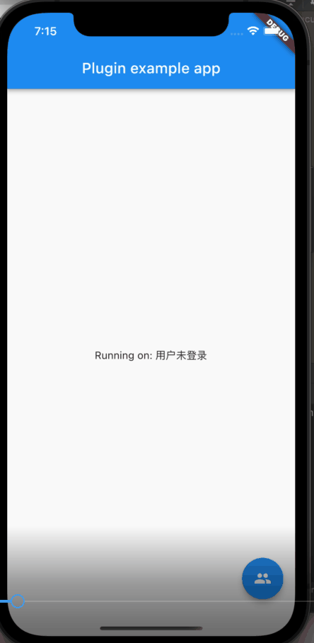

# Casdoor Flutter SDK

[](https://pub.dev/packages/casdoor_flutter_sdk)
[](https://pub.dev/packages/casdoor_flutter_sdk/score)
[](https://github.com/casdoor/casdoor-flutter-sdk/actions/workflows/dart.yml)
[](https://codecov.io/gh/casdoor/casdoor-flutter-sdk)
[](https://github.com/casdoor/casdoor-flutter-sdk/releases/latest)
[](#platform-setup)
[](LICENSE)
[](https://discord.gg/5rPsrAzK7S)

Sign users in to your Flutter app with [Casdoor](https://casdoor.ai), on Android, iOS, macOS, Linux, Windows and the Web.

The SDK opens the Casdoor sign-in page, gets the authorization code with the OAuth 2.0 authorization code flow and PKCE, and exchanges it for tokens. It also refreshes tokens, gets user info and signs users out.

| Android                        | iOS                    | Web                    |
| ------------------------------ | ---------------------- | ---------------------- |
|  |  |  |

## Installation

```bash
flutter pub add casdoor_flutter_sdk
```

Then follow the [platform setup](#platform-setup) for each platform you build for.

## Quick start

### 1. Configure

Create an application in Casdoor and add the redirect URI of your app to its **Redirect URLs**.

```dart
import 'package:casdoor_flutter_sdk/casdoor_flutter_sdk.dart';

final AuthConfig config = AuthConfig(
  clientId: '014ae4bd048734ca2dea',
  serverUrl: 'https://door.casdoor.com',
  organizationName: 'casbin',
  appName: 'app-casnode',
  // Native platforms: a custom scheme. Web: the callback page of your app.
  redirectUri: kIsWeb ? 'http://localhost:9000/callback.html' : 'casdoor://callback',
  callbackUrlScheme: 'casdoor',
);
```

| Parameter | Required | Description |
| --- | --- | --- |
| `clientId` | Yes | Client ID of the Casdoor application |
| `serverUrl` | Yes | URL of the Casdoor server, such as `https://door.casdoor.com` |
| `organizationName` | Yes | Organization of the application |
| `appName` | Yes | Name of the application |
| `redirectUri` | No | Redirect URI, `casdoor://callback` by default |
| `callbackUrlScheme` | No | Scheme of the redirect URI that ends the sign-in on native platforms, `casdoor` by default |

### 2. Sign in

```dart
final Casdoor casdoor = Casdoor(config: config);

// Opens the sign-in page and returns the redirect URL with `code` and `state`.
final String callbackUrl = await casdoor.show(scope: 'openid profile email');

// Rejects responses that were not started by this instance (CSRF protection).
if (!casdoor.isState(callbackUrl)) {
  throw Exception('state mismatch');
}

final String code = Uri.parse(callbackUrl).queryParameters['code']!;
final response = await casdoor.requestOauthAccessToken(code);
final Map<String, dynamic> tokens = jsonDecode(response.body);
final String accessToken = tokens['access_token'];
final String idToken = tokens['id_token'];
final String refreshToken = tokens['refresh_token'];
```

Use the same `Casdoor` instance for `show()` and `requestOauthAccessToken()`: it holds the PKCE code verifier, the nonce and the state of this sign-in.

On Android and iOS, `showFullscreen(context)` shows the sign-in page in a full screen page of your app instead of a separate window.

### 3. Use the tokens

```dart
// Claims of the access token, such as name, displayName, email and avatar.
final Map<String, dynamic> claims = casdoor.decodedToken(accessToken);

// User info from the server.
final userInfo = await casdoor.getUserInfo(accessToken);

// Gets a new access token when the current one expires.
if (casdoor.isTokenExpired(accessToken)) {
  final refreshed = await casdoor.refreshToken(refreshToken, null);
}
```

### 4. Sign out

```dart
// clearCache: true also clears the cookies of the sign-in page,
// so the next sign-in asks for the credentials again.
await casdoor.tokenLogout(idToken, null, 'logout', clearCache: true);
```

A complete app is in [example/lib/main.dart](example/lib/main.dart).

## Platform setup

| Platform | Sign-in page shown in |
| --- | --- |
| Android | In-app browser of [flutter_inappwebview](https://pub.dev/packages/flutter_inappwebview) |
| iOS | `ASWebAuthenticationSession` |
| macOS | In-app browser of flutter_inappwebview |
| Linux, Windows | Web view window of [desktop_webview_window](https://pub.dev/packages/desktop_webview_window) |
| Web | Popup window |

### Android

See the [setup guide](https://inappwebview.dev/docs/intro) of flutter_inappwebview.

On Android Gradle Plugin 9 or later (the default of new projects since Flutter 3.47), the build of `flutter_inappwebview_android` fails with ``getDefaultProguardFile('proguard-android.txt')` is no longer supported``. Until flutter_inappwebview is fixed ([issue](https://github.com/pichillilorenzo/flutter_inappwebview/issues/2852)), add this line to `android/gradle.properties`:

```properties
android.r8.proguardAndroidTxt.disallowed=false
```

### iOS

No setup is needed.

### macOS

Allow outgoing connections by adding this key to `macos/Runner/DebugProfile.entitlements` and `macos/Runner/Release.entitlements`:

```xml
<key>com.apple.security.network.client</key>
<true/>
```

### Linux and Windows

Add desktop_webview_window to your app:

```bash
flutter pub add desktop_webview_window
```

The sign-in window runs in a separate Flutter engine, so start your `main` function like this:

```dart
import 'package:desktop_webview_window/desktop_webview_window.dart';

void main(List<String> args) {
  WidgetsFlutterBinding.ensureInitialized();
  if (runWebViewTitleBarWidget(args)) {
    return;
  }
  runApp(const MyApp());
}
```

On **Linux**, install WebKitGTK, for example `sudo apt install libwebkit2gtk-4.1-dev` on Ubuntu. Don't install Flutter with Snap, the build fails with it.

On **Windows**:

- The sign-in window uses the [WebView2 Runtime](https://developer.microsoft.com/microsoft-edge/webview2/), which is preinstalled on Windows 11.
- [nuget.exe](https://www.nuget.org/downloads) must be in the `PATH` (for example `winget install Microsoft.NuGet`). The Windows build of flutter_inappwebview downloads its dependencies with it and fails with `NUGET-NOTFOUND` otherwise.
- Keep the path of your project short. The build fails with `Cannot open include file` when the full path of the flutter_inappwebview headers exceeds 260 characters.
- desktop_webview_window has a [known bug](https://github.com/MixinNetwork/flutter-plugins/issues/283) that crashes the sign-in window randomly.

### Web

Create `web/callback.html` in your app. Casdoor redirects the popup to this page, and the page sends the redirect URL back to your app:

```html
<!DOCTYPE html>
<title>Authentication complete</title>
<p>Authentication is complete. If this does not happen automatically, please close the window.
<script>
  window.opener.postMessage({
    'casdoor-auth': window.location.href
  }, window.location.origin);
  window.close();
</script>
```

Set `redirectUri` to this page on the origin your app runs on, such as `http://localhost:9000/callback.html`, and run the app on that port with `flutter run -d chrome --web-port 9000`. `callbackUrlScheme` is not used on the Web.

The token request is sent from the browser, so the Casdoor server must allow cross-origin requests from your app.

For Sign in with Apple in `web_message` response mode, the message from `https://appleid.apple.com` is also captured, and the authorization object is returned as the URL fragment.

## API

All methods are on the `Casdoor` class. The HTTP methods return the `http.Response` of the Casdoor API.

| Method | Description |
| --- | --- |
| `show({scope, state})` | Opens the sign-in page in a new window and returns the redirect URL |
| `showFullscreen(context, {isMaterialStyle, scope, state})` | Opens the sign-in page in a full screen page (Android and iOS) and returns the redirect URL |
| `getSigninUrl({scope, state})` | URL of the sign-in page |
| `getSignupUrl({scope, state})` | URL of the sign-up page |
| `isState(callbackUrl)` | Whether the `state` of the redirect URL belongs to this instance |
| `requestOauthAccessToken(code)` | Exchanges the authorization code for tokens |
| `refreshToken(refreshToken, clientSecret, {scope})` | Gets a new access token |
| `getUserInfo(accessToken)` | Gets the user info |
| `tokenLogout(idTokenHint, postLogoutRedirectUri, state, {clearCache})` | Signs the user out |
| `decodedToken(token)` | Decodes the payload of a JWT, without verifying its signature |
| `isTokenExpired(token)` | Whether a JWT has expired |
| `isNonce(idToken)` | Whether the ID token contains the nonce of this instance |

`show()` and `showFullscreen()` throw these exceptions:

| Exception | When |
| --- | --- |
| `CasdoorAuthCancelledException` | The user closed the sign-in page |
| `CasdoorDesktopWebViewNotAvailableException` | No web view is available on Linux or Windows |
| `CasdoorDesktopWebViewAlreadyOpenException` | A sign-in window is already open on Linux or Windows |
| `CasdoorMobileWebAuthSessionNotAvailableException` | `ASWebAuthenticationSession` is not available or already in use on iOS |
| `CasdoorMobileWebAuthSessionFailedException` | `ASWebAuthenticationSession` failed to start on iOS |

## Example

- [example/](example/): a minimal app in this repository
- [casdoor-flutter-example](https://github.com/casdoor/casdoor-flutter-example): a complete app with all platform folders

## License

[Apache-2.0](LICENSE)
